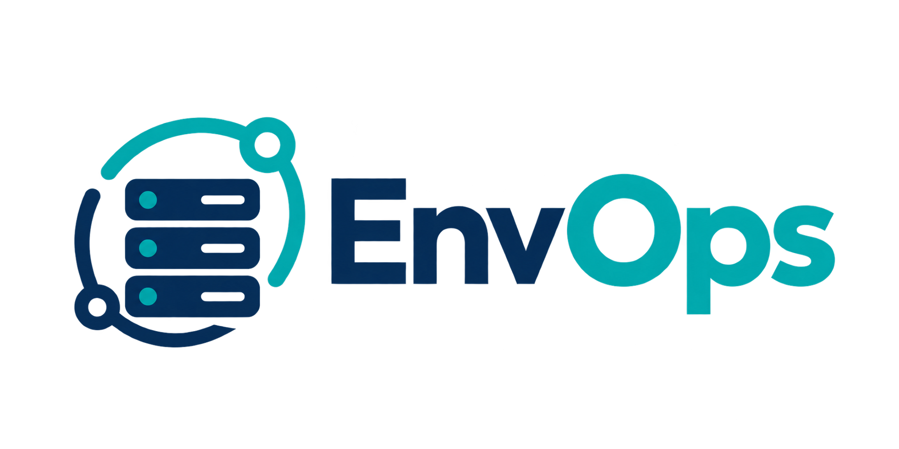

<p align="center">
  
</p>

<p align="center">
  <b>A Secure, Client-Only Mobile DevOps Command Center & SSH Client</b>
</p>

<p align="center">
  <a href="https://flutter.dev"></a>
  <a href="https://dart.dev"></a>
  <a href="https://riverpod.dev"></a>
  
  
  <a href="LICENSE"></a>
</p>

---

**EnvOps** is a client-only mobile DevOps console and SSH client built with Flutter. It empowers systems engineers, DevOps professionals, and on-call infrastructure administrators to monitor, diagnose, and securely manage Linux VPS clusters directly from their mobile devices — with **zero third-party cloud servers** and **zero external telemetry**.

Designed for incident response when you are away from your workstation, EnvOps provides instant telemetry, Docker management, health diagnostics, and a full PTY-backed interactive terminal with touch-friendly shortcuts.

---

## Architecture & Security Philosophy

EnvOps operates strictly on a **direct peer-to-peer SSH transport** model over private wire networks (e.g., **Tailscale**, WireGuard, or private VPN):

```
┌──────────────────────────────────────────────┐
│         Mobile Device (EnvOps App)          │
│  - Android KeyStore / iOS Keychain Secrets   │
│  - Offline AES-256 PBKDF2 Backup Service     │
│  - Strict Host Key Fingerprint Verifier      │
└──────────────────────┬───────────────────────┘
                       │ Direct TCP Port 22 (SSH)
                       │ End-to-End Encrypted Tunnel
                       ▼
┌──────────────────────────────────────────────┐
│       Private / Tailscale VPN Network        │
│          (e.g., 100.x.x.x / 10.x.x.x)        │
└──────────────┬───────────────┬───────────────┘
               │               │
               ▼               ▼
     ┌──────────────────┐    ┌──────────────────┐
     │  Linux VPS A     │    │  Linux VPS B     │
     │  Production      │    │  Staging / Dev   │
     │  - Nginx         │    │  - Gateways      │
     │  - Docker        │    │  - Redis/Workers │
     │  - PostgreSQL    │    │  - Docker        │
     └──────────────────┘    └──────────────────┘
```

### Core Security Guarantees

1. **Zero Cloud Dependencies**: No intermediate servers, brokers, or telemetry collectors. Data stays solely on your phone and your VPS.
2. **Hardware-Backed Key Storage**: OpenSSH private keys and passphrases are stored in the Android KeyStore / iOS Keychain via `flutter_secure_storage` (AES-GCM encryption with hardware key-wrapping).
3. **Mandatory SSH Host Key Verification**: Server host keys are checked against known SHA-256 fingerprints. Any fingerprint mismatch immediately **blocks the connection** to protect against Man-in-the-Middle (MITM) attacks and DNS poisoning.
4. **Offline Encrypted Backup & Device Migration**: Export and restore your complete server catalog and SSH keys across devices using AES-256-CBC with PBKDF2 (10,000 iterations of SHA-256 HMAC + random 16-byte salt and IV). No cloud database needed.
5. **Command Safety Classification**:
   - 🟢 **Read-Only / Diagnostic**: (`docker ps`, `free -h`, `df -h`, `uptime`, `ss -lntp`) Single-tap execution.
   - 🟡 **Service-Impacting**: (`docker restart`, `systemctl restart`) Requires explicit confirmation dialog.
   - 🔴 **Destructive Operations**: Production servers require typing strict confirmation phrases to prevent accidental downtime.
6. **AI-Ready Sanitized Incident Reports**: Diagnostic logs copied via the "Copy for AI" feature automatically redact credentials, passwords, tokens, connection strings, and private keys.
7. **Biometric & App Lock**: Optional biometric authentication (fingerprint / face / device PIN) protects the application from unauthorized physical access.

---

## Key Features

- **PTY-Backed Interactive Terminal**:
  - Full VT100 / xterm ANSI terminal powered by `xterm.dart` and `dartssh2` with dynamic resize (`SIGWINCH`), colors, and scrollback.
  - Virtual shortcut bar: `CTRL`, `TAB`, `ESC`, `ALT`, arrow keys (`↑`, `↓`, `←`, `→`), `|`, `/`, `~`, `CTRL+C`, `CTRL+D`, `CTRL+L`.
  - Supports interactive tools (`top`, `htop`, `less`, `journalctl -f`, `tail -f`).
- **Real-Time System Health**:
  - Instant dashboard cards for CPU Load, Memory (`free -h`), Disk Usage (`df -h`), Inodes (`df -i`), Uptime, and Listening Ports (`ss -lntp`).
  - Top 20 CPU and Memory process inspection.
  - HTTP health checks for public or private application endpoints.
- **Docker Container Management**:
  - Live container table with real-time status (Running, Restarting, Exited).
  - One-tap inspection: container ID, image, ports, uptime, state.
  - Live container log streaming (`docker logs --follow --tail N`) with timestamp toggle.
  - Safe container restart and control actions.
- **Multi-Environment Organization**:
  - Categorize servers by **Production**, **Staging**, **Development**, or **Monitoring**.
  - Distinct visual badges, border highlights, and guarded controls for production environments.
- **Offline / Dev Mock Mode**:
  - Built-in mock SSH engine allows full UI testing and demonstration without active network connections or live VPS servers.

---

## Project Structure

This project follows Clean Architecture principles:

```
lib/
├── core/
│   ├── constants/          # Application constants & command lists
│   ├── errors/             # Failure models and exception handling
│   ├── security/           # AES-256 PBKDF2 crypto, secure storage, host key verification
│   └── theme/              # High-contrast dark cybersecurity UI theme
├── data/
│   ├── repositories/       # Dart SSH repository, local storage, mock SSH implementation
│   └── services/           # Encrypted backup & export/import migration service
├── domain/
│   ├── models/             # ServerConfig, SshKeyModel, DockerContainer, ServerProfile
│   └── repositories/       # Abstract repository interfaces
└── presentation/
    ├── providers/          # Riverpod state notifiers & dependency injection
    └── screens/
        ├── dashboard/      # Main fleet overview and quick health metrics
        ├── servers/        # Server detail, diagnostics, and add/edit forms
        ├── terminal/       # PTY-backed interactive SSH terminal
        ├── keys/           # SSH key manager (import, generate, inspect fingerprints)
        └── settings/       # App lock, dev mode, and encrypted backup/restore
```

---

## Server-Side SSH Setup Guide

### 1. Generate an Ed25519 Key Pair
On your workstation or mobile terminal:
```bash
ssh-keygen -t ed25519 -C "env-ops-mobile" -f ~/.ssh/env_ops_mobile
```
- **Private Key** (`~/.ssh/env_ops_mobile`): Import into EnvOps under **Settings -> SSH Keys**.
- **Public Key** (`~/.ssh/env_ops_mobile.pub`): Deploy to target servers.

### 2. Configure `authorized_keys` on Target VPS
On each remote Linux VPS:
```bash
mkdir -p ~/.ssh
chmod 700 ~/.ssh

# Append your public key
cat << 'EOF' >> ~/.ssh/authorized_keys
ssh-ed25519 AAAAC3NzaC1lZDI1NTE5AAAAI... env-ops-mobile
EOF

chmod 600 ~/.ssh/authorized_keys
```

### 3. Verify Server Host Key Fingerprint (SHA-256)
On the target VPS, obtain the SHA-256 host fingerprint:
```bash
sudo ssh-keygen -lf /etc/ssh/ssh_host_ed25519_key.pub -E sha256
```
Copy the string starting with `SHA256:...` into the **SSH Host Fingerprint** field in EnvOps to enable strict host-key verification.

---

## Getting Started & Development

### Prerequisites
- [Flutter SDK](https://docs.flutter.dev/get-started/install) 3.19+ (Dart 3.3+)
- Android Studio / Android SDK 34+
- Optional: Xcode 15+ for iOS builds

### Installation
```bash
# 1. Clone repository
git clone https://github.com/your-username/env-ops.git
cd env-ops

# 2. Install dependencies
flutter pub get

# 3. Verify static code analysis
flutter analyze

# 4. Run automated test suite
flutter test

# 5. Launch the application on a connected device
flutter run
```

### Building for Release
```bash
# Build Android APK
flutter build apk --release

# Output path:
# build/app/outputs/flutter-apk/app-release.apk
```

---

## Security & Publishing Notes

This repository is pre-configured with strict `.gitignore` rules to prevent accidental credential leakage:
- Private keys (`*.pem`, `*.key`, `id_rsa*`, `id_ed25519*`) are strictly ignored.
- Android Keystores (`*.jks`, `*.keystore`, `key.properties`, `local.properties`) are strictly ignored.
- Environment files (`.env*`) and encrypted backup dumps (`*.backup`, `*backup*.json`, `cas_ops_backup*`) are strictly ignored.
- All pre-seeded demo data uses reserved private network ranges (RFC 6598 / RFC 1918) and mock host fingerprints.

---

## Tech Stack

| Component | Library / Tool |
|---|---|
| Framework | [Flutter](https://flutter.dev) |
| State Management | [Riverpod](https://riverpod.dev) |
| SSH & Terminal | [dartssh2](https://pub.dev/packages/dartssh2) & [xterm.dart](https://pub.dev/packages/xterm) |
| Secure Storage | [flutter_secure_storage](https://pub.dev/packages/flutter_secure_storage) |
| Cryptography | [pointycastle](https://pub.dev/packages/pointycastle) (AES-256-CBC, PBKDF2) |
| Navigation | [go_router](https://pub.dev/packages/go_router) |
| Biometrics | [local_auth](https://pub.dev/packages/local_auth) |

---

## License

This project is licensed under the MIT License — see the [LICENSE](LICENSE) file for details.
